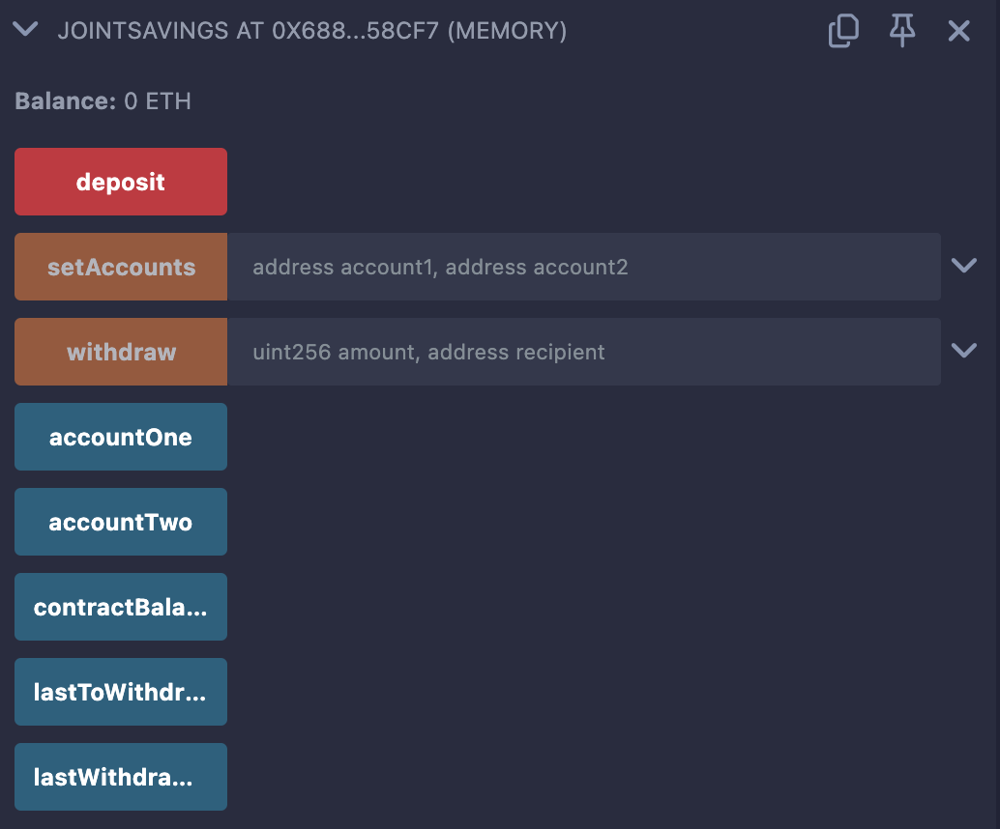
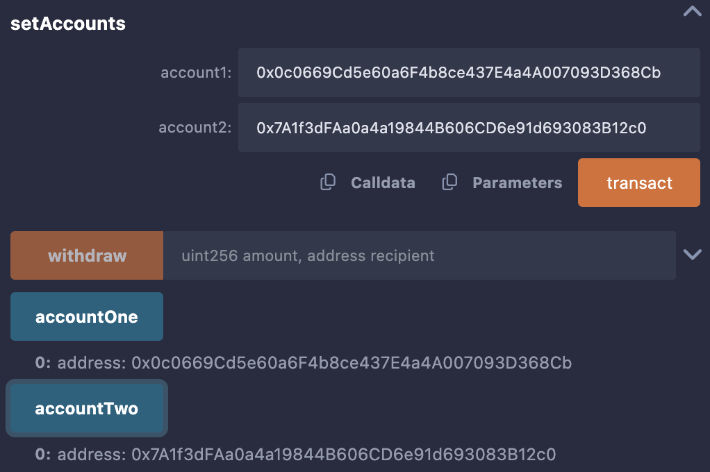
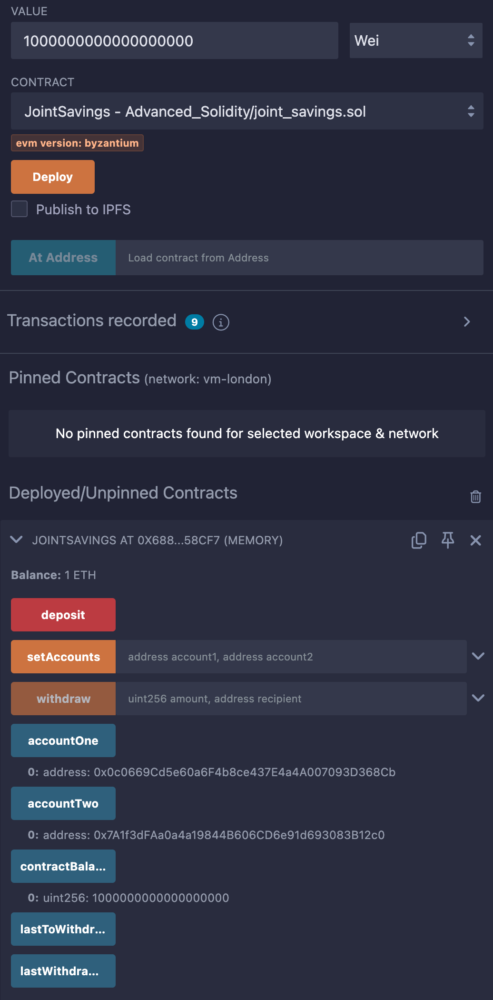
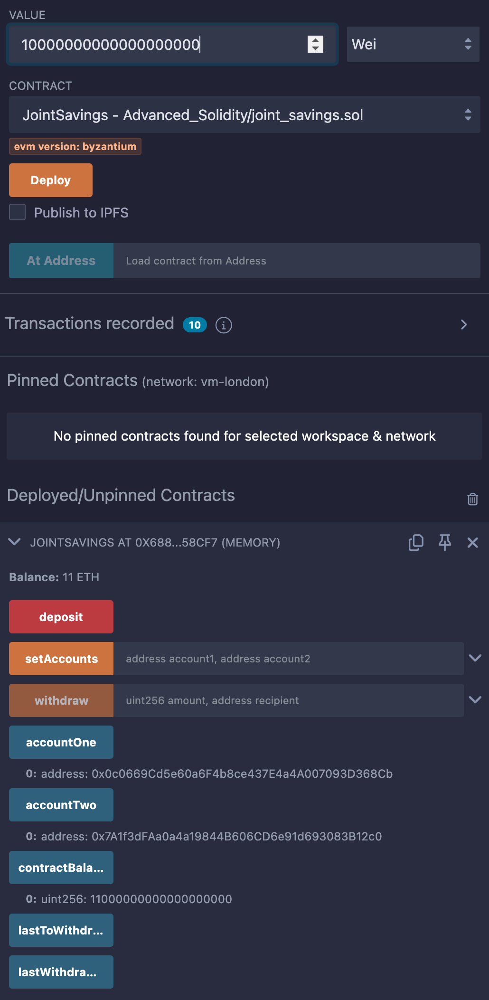
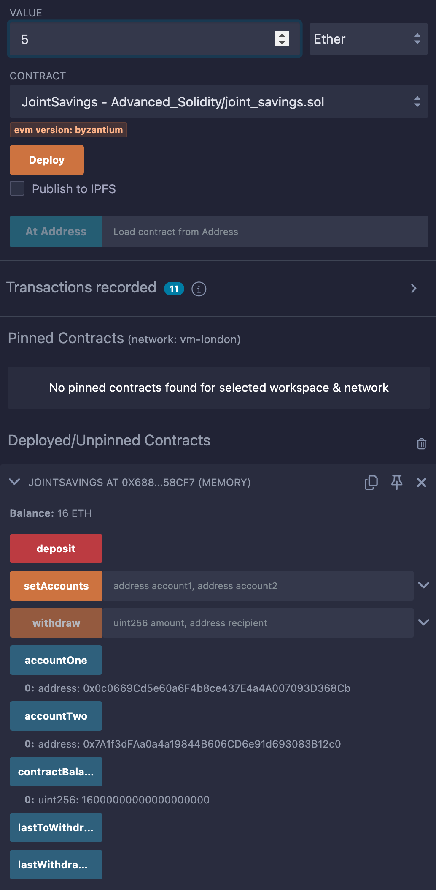
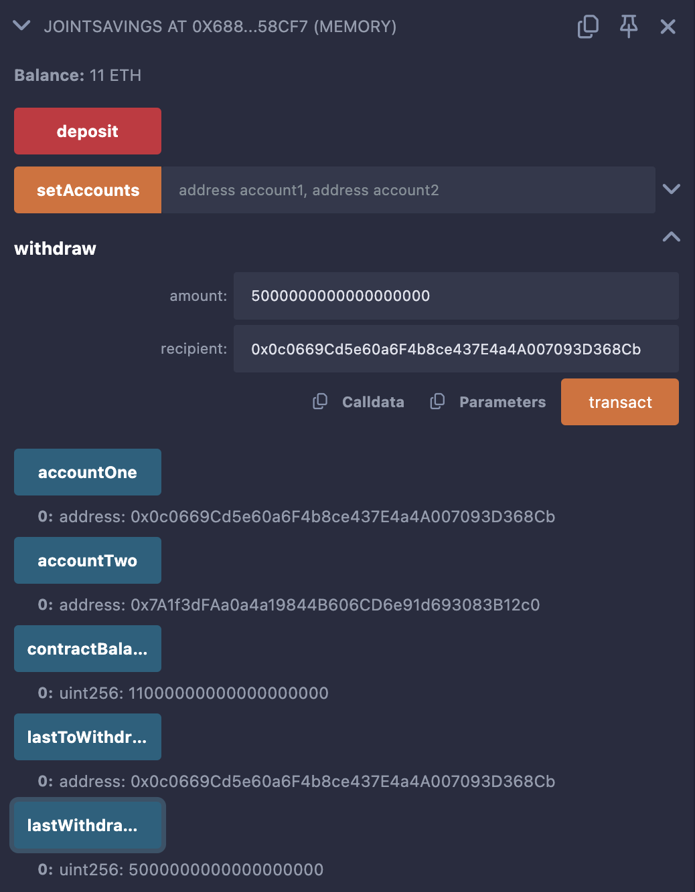

# Module 20 Challenge - Joint Savings Account


## Overview
For this project I assume the role a smart contract developer, creating Ethereum-compatible blockchain instruments that connect financial institutions. 

The goal of the challenge is to automate the creation of a joint savings account by creating a Solidity smart contract that accepts two user addresses that can deposit and withdraw funds from the account using ether management functions in accordance with the financial institution's requirements. 


<!-- The application consists of two files:

1. [krypto_jobs.py](krypto_jobs.py) This is the primary file that contains the user interface for the application, compatible with the Streamlit library. 
   
2. [crypto_wallet.py](crypto_wallet.py) This is the secondary file that contains the Ethereum transaction functions that will be called upon by the primary file by way of import statements. 

[Ganache](https://archive.trufflesuite.com/ganache/), a development tool that simulates an Ethereum blockchain, was used to test the application and validate the results.

## Libraries and Dependencies
The krypto_jobs.py file loads the following libraries and dependencies.
```python
# Imports
import streamlit as st
from dataclasses import dataclass
from typing import Any, List
from web3 import Web3
```
The crypto_wallet.py file loads the following libraries and dependencies.
```python
# Imports
import os
import requests
from dotenv import load_dotenv

load_dotenv()
from bip44 import Wallet
from web3 import Account
from web3 import middleware
from web3.gas_strategies.time_based import medium_gas_price_strategy
``` -->
<!-- ## End-user Instructions
The application will require a development environment that has the afforementioned libraries installed. 

Once the files have been relocated to your local machine, the application can be run from a terminal window within your IDE (Visual Studio was used to develop the application) from the correct development environment containing the above, by typing the following command. 

```python
streamlit run krypto_jobs.py
``` -->
## Application Results
Below are the screenshots of the smart contract (developed in Solidity), which has been compiled and deployed in the Remix online development environment.

### Contract Deployed


### Using the `setAccounts` function to define the authorized Ethereum addresses



| Plot            | Classification Report            |
|--------------------|--------------------|
|  |  |


### Test Transaction 1 - send 1 ether as wei


### Test Transaction 2 - send 10 ether as wei


### Test Transaction 3 - send 5 ether


### Test withdrawal functionality - withdraw 5 ether into `accountOne`


### Test withdrawal functionality - withdraw 10 ether into `accountTwo`


## Sources
The following sources were consulted in the completion of this project. 

* UCB FinTech Bootcamp instructor-led coding exercises

## License
[MIT License](LICENSE)