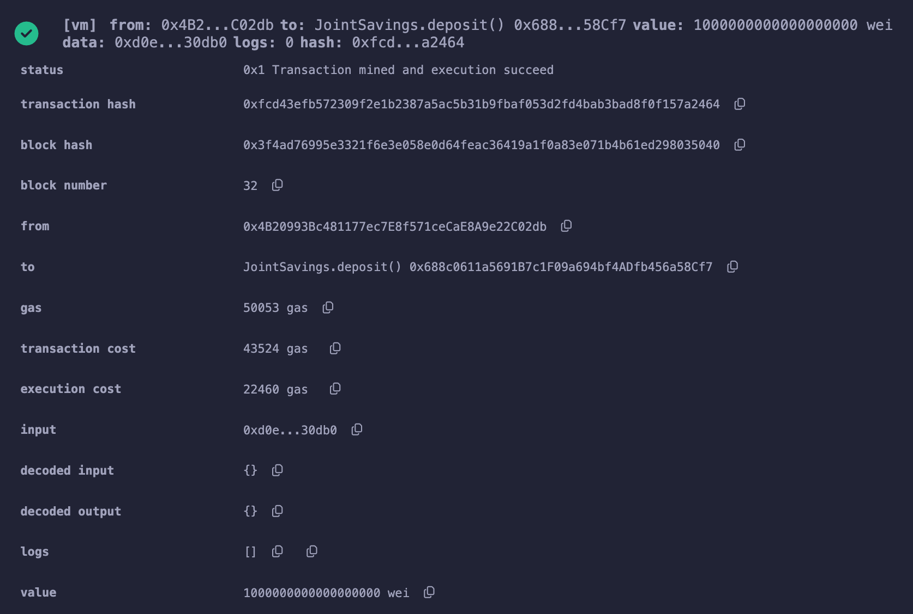

# Module 20 Challenge - Joint Savings Account

## Overview
For this project I assume the role a smart contract developer, creating Ethereum-compatible blockchain instruments that connect financial institutions. 

The goal of the challenge is to automate the creation of a joint savings account by creating a Solidity smart contract that accepts two user addresses that can deposit and withdraw funds from the account using ether management functions in accordance with the financial institution's requirements. 

## Technologies
The smart contract was developed using the following language and development environment. 

* [Solidity](https://soliditylang.org/): programming language designed for developing smart contracts that run on Ethereum
* [Remix](https://remix.ethereum.org/): a native IDE for Web3 Development and deployment of smart contracts

## Libraries and Dependencies

The [notebook](machine_learning_trading_bot.ipynb) loads the following libraries and dependencies.

## Installation
Follow the link to [Remix](https://remix.ethereum.org/) and use the `upload` function to load the [`joint_savings.sol`](joint_savings.sol) file. Compile and Deploy the file. 

## Application Results
Below are the screenshots of the smart contract (developed in Solidity), which has been compiled and deployed in the Remix online development environment.

### Contract Deployed

### Using the `setAccounts` function to define the authorized Ethereum addresses

### Test Transaction 1 - send 1 ether as wei

### Test Transaction 2 - send 10 ether as wei

### Test Transaction 3 - send 5 ether

### Test withdrawal functionality - withdraw 5 ether into `accountOne`

### Test withdrawal functionality - withdraw 10 ether into `accountTwo`

## Sources
The following sources were consulted in the completion of this project. 

* UCB FinTech Bootcamp instructor-led coding exercises

## License
[MIT License](LICENSE)